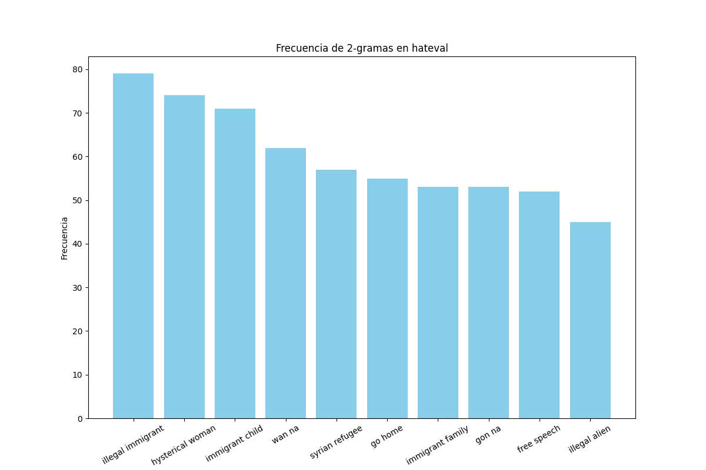
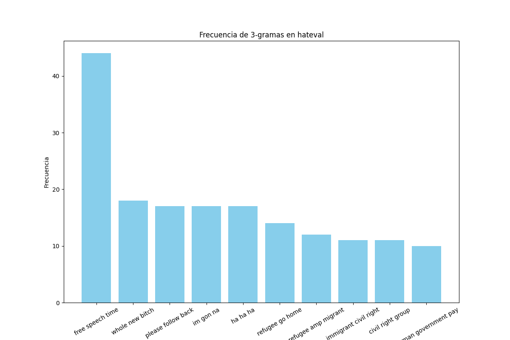
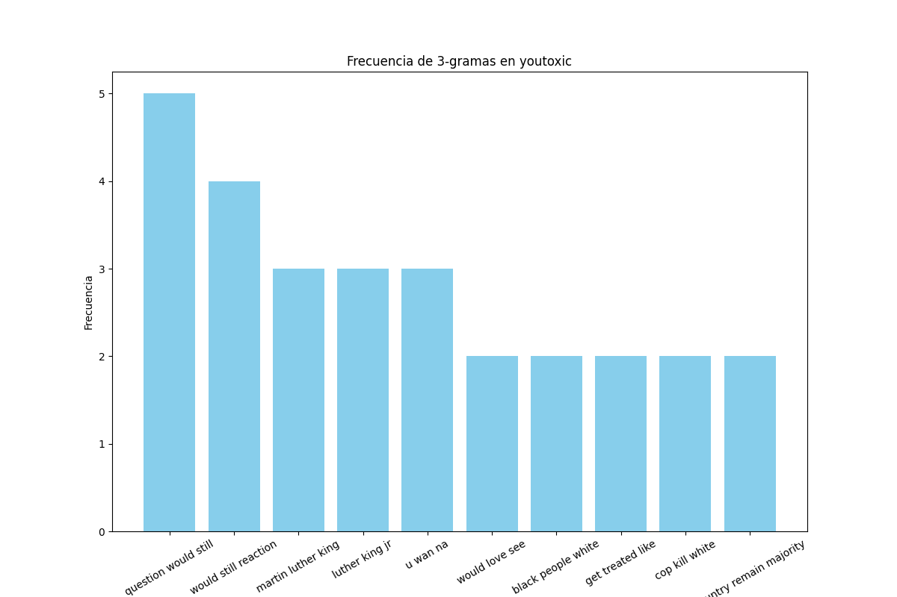

<h1>Datasets</h1>

### HatEval
Es un dataset sacado de twitter, donde los datos estan etiquetados segun si contienen o no discurso de odio, en particular contra immigrantes y mujeres. Contiene 19,600 tweets, 13,000 en inglés y 6,600 en español.
Elegimos este dataset por la simpleza, consistencia, y balanceo de los datos.
Como hateval provee 3 datasets: train, dev, test con cantidades distintas, lo que hicimos fue juntar estos 3 datasets para poder dividir 80% train y 20% test como habiamos propuesto. Los analisis siguientes se haran sobre el dataset combinado.
### Youtoxic
Es un dataset de comentarios recolectados de youtube sobre el “Ferguson unrest”. Los datos estan etiquetados segun si contienen o no discuso de odio, son toxicos, etc. Contiene 1000 comentarios, y lo elegimos por la 
cantidad de etiquetas y simpleza.

<h1>Analisis exploratorio de los datos</h1>

### Balanceo de clases HatEval

Vemos que hay muchos mas comentarios que no son discurso de odio, por lo tanto un modelo entrenado sobre estos datos puede que detecte mucho mejor lo que no es odio. Probaremos entrenar un modelo con estas cantidades, y luego haciendo un balanceo, que sera un sub-sampling.

### Balanceo de clases Youtoxic

Para youtoxic decidimos usar las columnas IsHatespeech, y IsToxic, que nos dicen si el comentarios es discurso de odio o toxico respectivamente. La clase IsToxic esta relativamente balanceada, mientras que IsHatespeech indica tiene muchos mas comentarios que no son discurso de odio de los que si son.
A pesar de los pocos datos de este dataset, lo usaremos para ver como le va al modelo entrenado con muchos menos datos, y si es mucha la diferencia con entrenar uno con mas datos. Ademas nos sera util para saber si muchos comentarios de odio son en si mismo toxicos, lo cual creemos que si. 

---
### Longitud promedio de comentarios HatEval

General                    |  Odio                     |   Sin Odio
:-------------------------:|:-------------------------:|:-------------------------:
  |    |  

Viendo las 3 distribuciones de longitud de comentarios en hateval, nos damos cuenta que en general los comentarios rondan las 20 palabras, y los que tienen mas (o menos) son mas poquitos. No podemos concluir mucho a cerca de patrones odio vs no odio a partir del largo de los comentarios.

---
### Longitud promedio de comentarios Youtoxic

General                    |  Odio                     |   Sin Odio
:-------------------------:|:-------------------------:|:-------------------------:
  |    |  

Vemos una tendencia a comentarios de menos de 20 palabras cuando no son odio, pero alrededor de 30 si contienen odio. Tambien vemos datos divergentes, que sugieren comentarios mas elaborados y largos.
Es llamativo que los comentarios de youtube sean en general mas cortos que los de twitter, ya que twitter tiene un limite de caracteres, y youtube en ese sentido permite comentarios mas largos. 

---
### Frecuencia de palabras HatEval - Comentarios en general

Se puede ver un fuerte uso de la palabra "bitch" o "women", esto pude sugerir que haya mas comentarios del topico mujeres que immigrantes.
### Frecuencia de palabras HatEval - Comentarios sin odio

Acá nos llamo la atencion que este nuevamente bitch, pero tiene sentido ya que se usa como un insulto o mala palabra, no siempre con el objetivo de odio hacia las mujeres (aunque suene muy feo y en el fondo se genere un odio indirecto). Lo mismo con la palabra refugee, o women, por lo tanto podriamos decir que no son indicadores fuertes de odio.
### Frecuencia de palabras HatEval - Comentarios con odio

Nuevamente bitch predomina, seguido de women, hoe, etc. Esto sugiere que el dataset tiene mas comentarios de odio hacia mujeres que hacia immigrantes.
"Hoe" podria ser un indicador de odio hacia mujeres, ya que no aparece de manera frecuente en los comentarios de no odio. Lo mismo con "illegal", "refugee" o "buildthatwall", que está relacionada con un lema político conocido, es decir que hay cierta referencias politicas.

---
### Frecuencia de palabras Youtoxic - Comentarios en general

### Frecuencia de palabras Youtoxic - Comentarios sin odio

### Frecuencia de palabras Youtoxic - Comentarios con odio

En general vemos que aparecen las mismas palabras en los 3 analisis, por ahi al tener muy poquitos datos se hace dificil encontrar patrones en palabras.
Podemos observar que "thug" aparece en los de odio y no en los demas, asique podria tratarse de una palabra caracteristica en el discurso de odio racista.

---
### Bi-grama HatEval de comentarios con odio

Con hashtags               |  Sin hashtags             |
:-------------------------:|:-------------------------:|
  |  

Vemos que si dejamos los hashtags, surgen bi-gramas como "trump maga". Tambien notamos que no hay un bi-grama muy frecuente, teniendo en cuenta que hay alrededor de 7000 comentarios de odio.
### Bi-grama HatEval de comentarios sin odio

Con hashtags               |  Sin hashtags             |
:-------------------------:|:-------------------------:|
  |  

Al igual que antes hay una minima diferencia, pero llama la antencion encontrar "ass bitch", sera que se usa como un insulto general?

### Tri-grama HatEval de comentarios con odio

Con hashtags               |  Sin hashtags             |
:-------------------------:|:-------------------------:|
  |  

### Tri-grama HatEval de comentarios sin odio

Con hashtags               |  Sin hashtags             |
:-------------------------:|:-------------------------:|
  |  

---
### Youtoxic comentarios con odio

Bi-grama                   |  Tri-grama             |
:-------------------------:|:-------------------------:|
  |  

### Youtoxic comentarios sin odio

Bi-grama                   |  Tri-grama             |
:-------------------------:|:-------------------------:|
  |  

