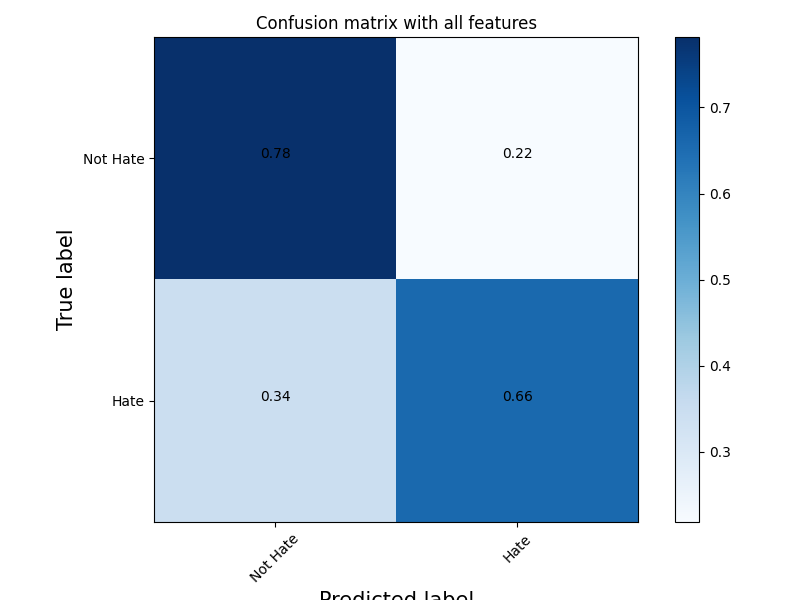
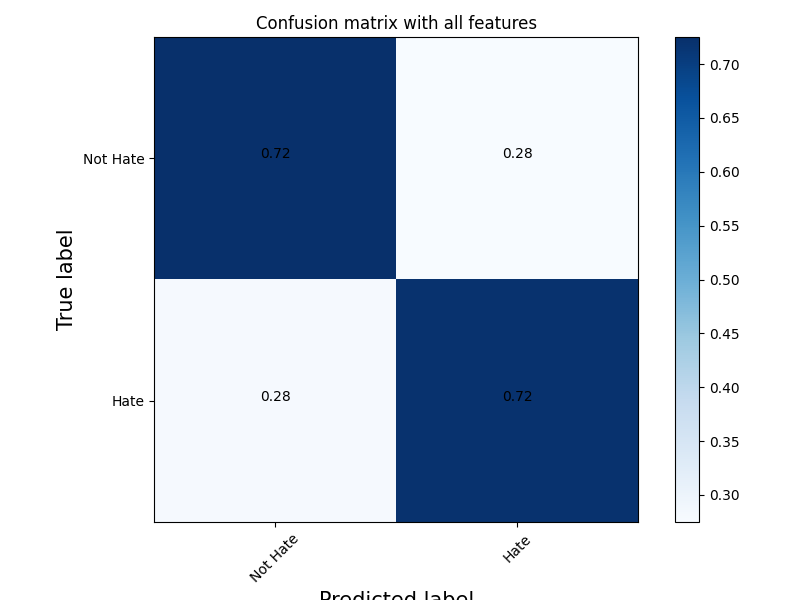
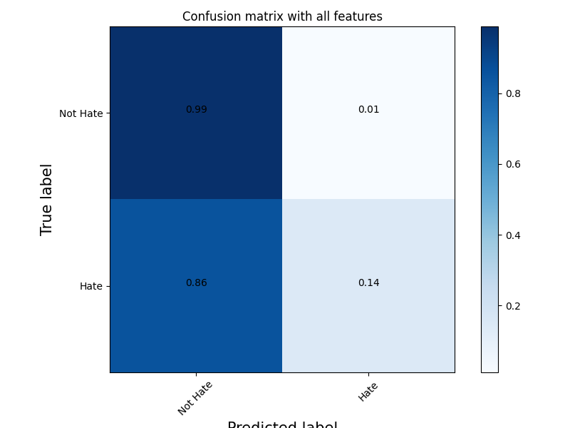
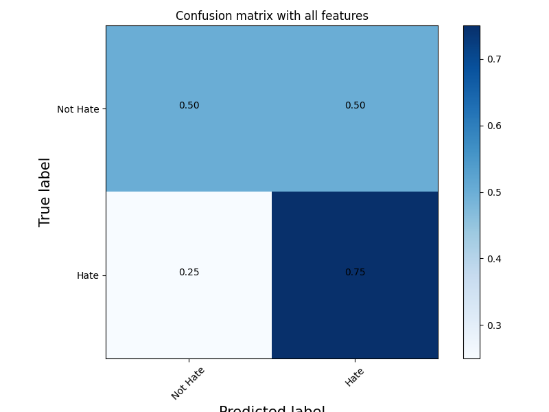
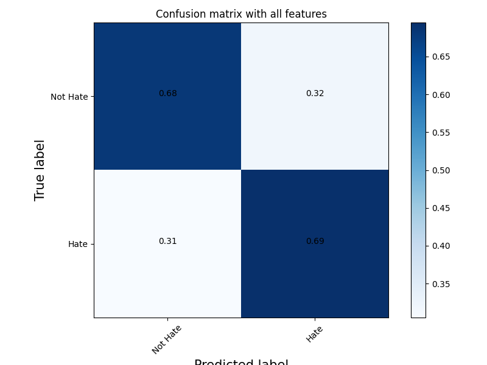
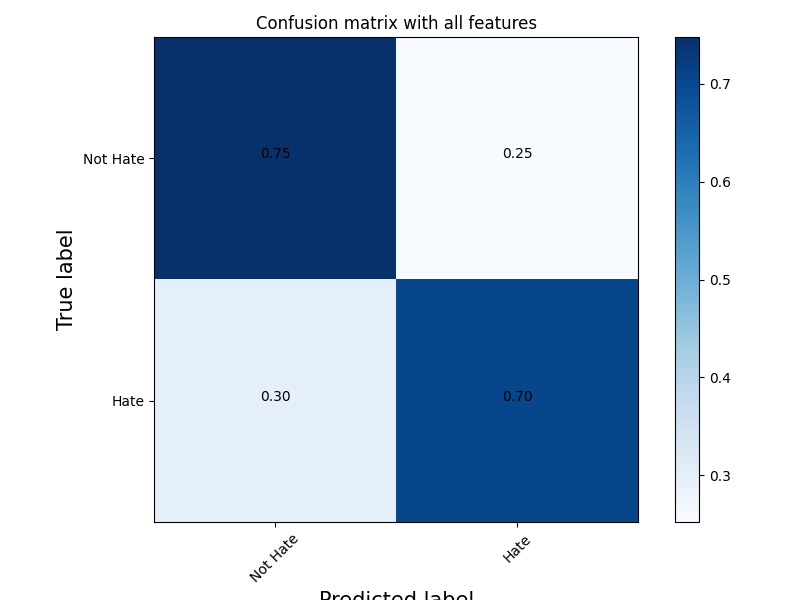
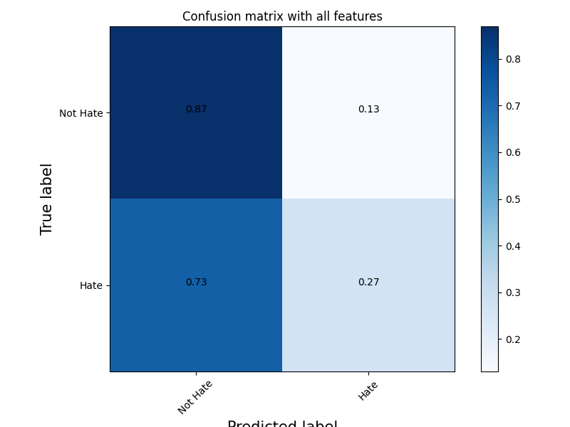
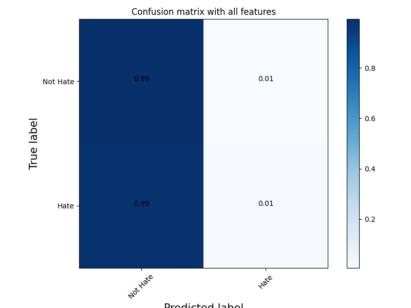

<h1>Clasificacion de Discurso de Odio</h1>

Se decidió entrenar modelos support vector machine con los datasets vistos anteriormente. La idea es explorar distintas formas de optimizar el modelo para ver cual nos da una mejor prediccion, y hacer un analisis usando distintas metricas. 

## Proceso

1. **Preprocesamiento de los datos**: Se limpiaran los datos eliminando simbolos y caracteres especiales. Con los hashtags se hizo una comparacion dejandolos y sacandolos, donde dejarlos dio mejores resultados. Cabe aclarar que esto es para hateval que fue sacado de twitter.

2. **Conversion de comentarios**: Se convierten los comentarios a una representacion numerica. Exploraremos varios tipos de conversiones que se pueden hacer. En principio, usaremos One-Hot Encoders como TF-IDF, BagOfWords y N-gramas, y luego probaremos tecnicas mas complejas como Word Embeddings.    

3. **Entrenamiento y evaluacion**: Primero se entrenará y evaluara un modelo lineal SVM sobre el mismo dataset. Luego se evaluara cada modelo sobre el dataset opuesto.   

4. **Metricas y conclusiones**: Usando distintas metricas sacaremos conclusiones acerca de como le fue al modelo y que influyo en dicha performance. Las metricas que usaremos seran: matrices de confusion, accuracy, precision, recall, macro-averaged F1-score. 

## SVM con TF-IDF

### Sin balanceo de clases (Entrenado y evaluado en Hateval)

* Accuracy: **0.7288461538461538**    
* Precision: **0.6857688634192932**  
* Recall: **0.6563071297989032** 
* Macro-averaged F1-score: **0.7201235731531783** 

### Con balanceo de clases (Entrenado y evaluado en Hateval)

* Accuracy: **0.7225776965265083**
* Precision: **0.7235996326905417**
* Recall: **0.720292504570384**
* Macro-averaged F1-score: **0.7225762477913003**

### Sin balanceo de clases (Entrenado y evaluado en Youtoxic)

* Accuracy: **0.87**
* Precision: **0.6666666666666666**
* Recall: **0.14285714285714285**
* Macro-averaged F1-score: **0.5821279331404693**

### Con balanceo de clases (Entrenado y evaluado en Youtoxic)

* Accuracy: **0.625**
* Precision: **0.6**
* Recall: **0.75**
* Macro-averaged F1-score: **0.6190476190476191**

## SVM con Bag Of Words

### Con balanceo de clases (Entrenado y evaluado en Hateval)

* Accuracy: **0.6882998171846435**
* Precision: **0.6859205776173285**
* Recall: **0.6946983546617916**
* Macro-averaged F1-score: **0.6882870552571176**

## SVM con N-gramas

### Con balanceo de clases (Entrenado y evaluado en Hateval)

* Accuracy: **0.7257769652650823**
* Precision: **0.7361376673040153**
* Recall: **0.7038391224862889**
* Macro-averaged F1-score: **0.7256449266881781**

## SVM con FastText pre-entrenado 

### Con balanceo de clases (Entrenado y evaluado en Hateval)

* Accuracy: **0.6992687385740403**
* Precision: **0.6925795053003534**
* Recall: **0.716636197440585**
* Macro-averaged F1-score: **0.6991780020476817**

## Evaluacion Cruzada
El modelo que tuvo mejor desempeño fue el que usa n-gramas entrenado en hateval balanceado, por lo tanto para medir su generalizacion lo evaluaremos sobre el dataset youtoxic sin balancear.

* Accuracy: **0.786**
* Precision: **0.24666666666666667**
* Recall: **0.26811594202898553**
* Macro-averaged F1-score: **0.5659722222222222**

Detecta muy mal hate speech!! Y tiene sentido, ya que si vemos el analisis de N-gramas y palabras frecuentes de ambos datsets, youtoxic tiene muchas palabras racistas que en los analsis de hateval ni aparecen, entonces se podria decir que le falta generalizacion al modelo. Por otro lado detecta muy bien lo que NO es hate speech, y hasta le hubiera ido mucho mejor si lo entrenabamos con el dataset sin balancear, ya que esta sesgado a no hate speech (tiene mas ejemplos).

### Que pasa si evaluamos el modelo entrenado con youtoxic sobre hateval?

* Accuracy: **0.5817692307692308**
* Precision: **0.6299212598425197**
* Recall: **0.014625228519195612**
* Macro-averaged F1-score: **0.3810531616759179**

Como era de esperar, no supo detectar hate. Asumimos que es por la misma razon que antes, no hay temas en comun. Igualmente sorprendio lo bien que detecta el No hate, mucho mejor que Hateval.