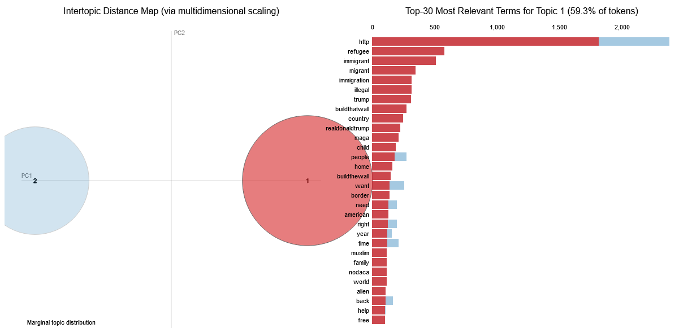
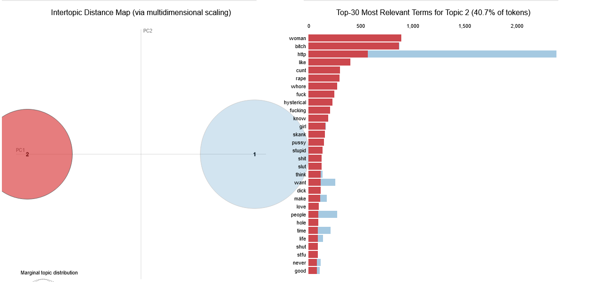
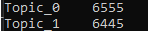
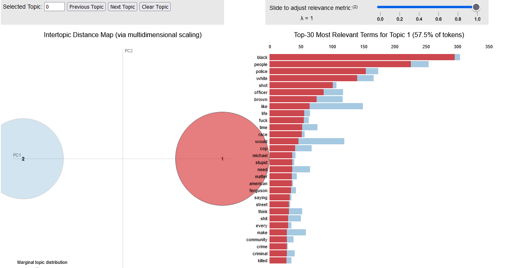
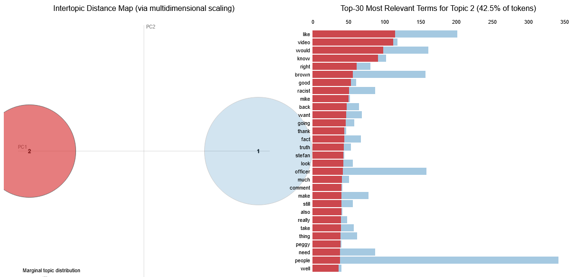
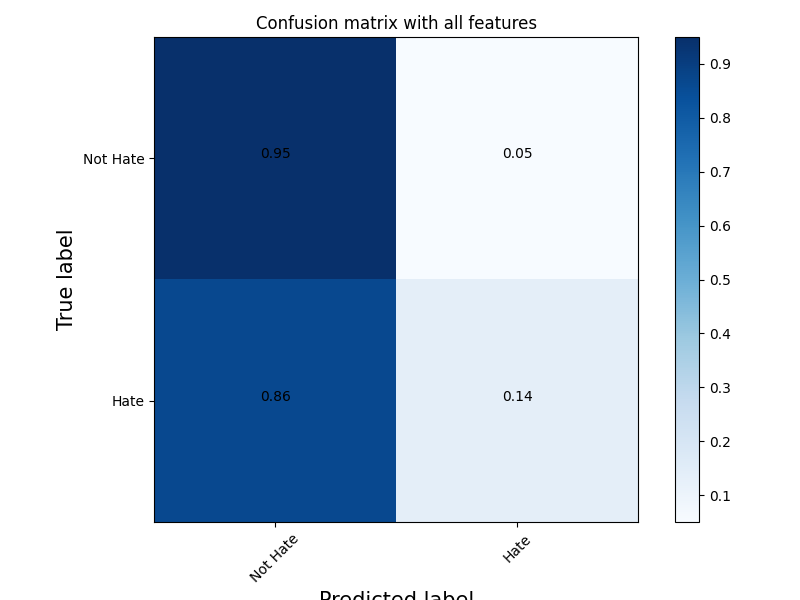
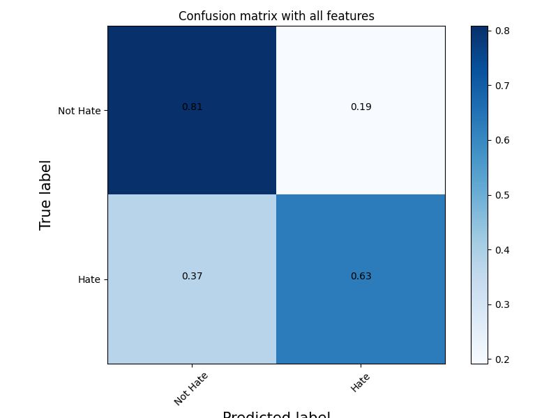
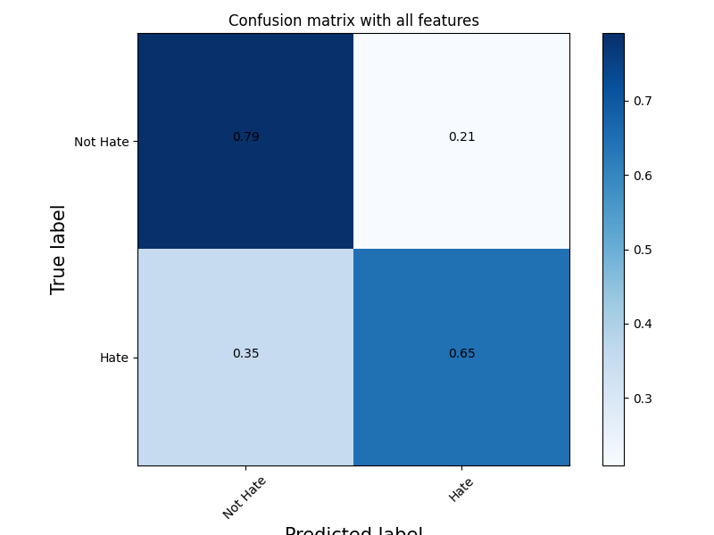

## Proceso

1. **Deteccion de temas**: Se detectaron los temas relevantes de cada dataset usando LDA. En hateval los temas fueron contra mujeres e immigrantes, mientras que en youtoxic el unico tema fue de racismo. 

2. **Entrenamiento de modelos tematicos**: Se entrenaron modelos SVM usando n-gramas para poder clasificar odio de cada tema especifico detectado con LDA.

3. **Aplicación cruzada**: Consiste en la evaluacion de dichos modelos sobre el topico mas cercano del dataset opuesto. En este caso se evaluó el modelo entrenado para detectar odio contra inmigrantes sobre el dataset youtoxic. Ademas, como el dataset youtoxic difiere mucho de hateval, lo que hicimos fue evaluar el rendimiento de un modelo de "Voto Mayoritario", que esta compuesto de los 2 modelos de deteccion de odio de cada tema de hateval.

4. **Análisis de errores**: Se comparó la tasa de aciertos juntando los modelos tematicos y se la comparo con el modelo en general luego de evaluar sobre un mismo test set, concluyendo asi si combiene o no hacer modelos tematicos para tener una mejor clasificacion de comentarios de odio.

## Temas detectados Hateval

Luego de hacer la clasificacion con lda en 2 categorias para el dataset hateval, nos quedan la siguiente cantidad de comentarios:

Que es muy cercana a la cantidad de comentarios de cada tema segun el paper de hateval.

## Temas detectados Youtoxic

## Modelo tematico hateval
### Entrenado para detectar odio contra inmigrantes y evaluado sobre youtoxic

* Accuracy: **0.837**
* Precision: **0.30158730158730157**
* Recall: **0.13768115942028986**
* Macro-averaged F1-score: **0.5492244171029234**

### Modelo de "Voto Mayoritario"

* Accuracy voto mayoritario: **0.7311538461538462**
* Precision voto mayoritario: **0.7029804727646455**
* Recall voto mayoritario: **0.6252285191956124**
* Macro-averaged F1-score voto mayoritario: **0.7193599479671664**

### Modelo General

* Accuracy modelo general: **0.7296153846153847**
* Precision modelo general: **0.6911045943304008**
* Recall modelo general: **0.6462522851919561**
* Macro-averaged F1-score modelo general: **0.7199508297517693**