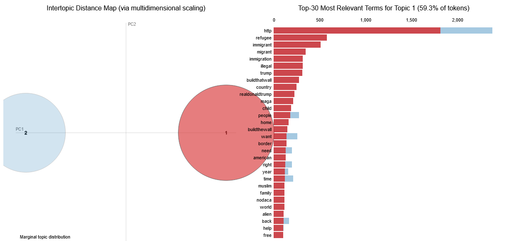
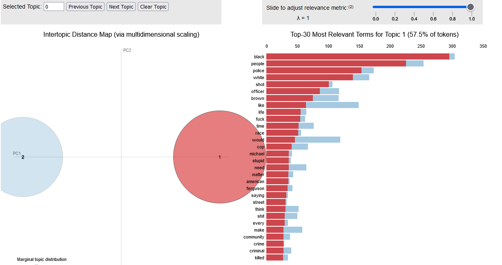
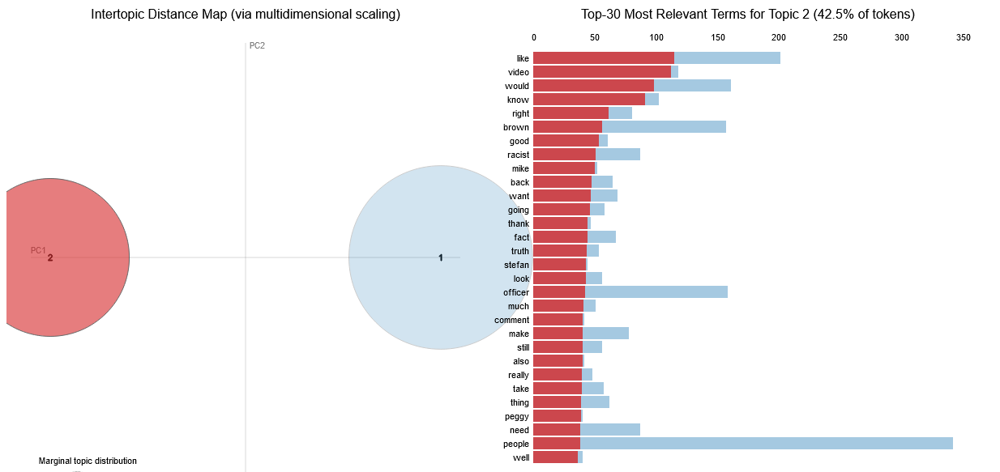

# Punto 3: Análisis de Modelos Temáticos y Transferibilidad

## 🚀 Guía de Instalación y Ejecución

Para garantizar la reproducibilidad de los experimentos y el análisis de resultados, siga los pasos detallados a continuación.

### 1. Requisitos Previos
* Python 3.9 o superior.
* Acceso a una terminal (PowerShell, CMD o Bash).

### 2. Configuración del Entorno Virtual
Se recomienda el uso de un entorno virtual para aislar las dependencias del proyecto y evitar conflictos de versiones.

**En Windows (PowerShell):**
```
python -m venv venv

Set-ExecutionPolicy -ExecutionPolicy Bypass -Scope Process

.\venv\Scripts\activate
```
**Instalación de librerías:**
```
pip install -r requerimientos.txt
```
**Ejecución:**
```
python main.py
```


## Objetivo
Evaluar si la especialización de modelos en tópicos específicos (detectados mediante LDA) mejora la detección de odio en comparación con un modelo generalista, y analizar cómo se transfieren estos conocimientos entre dominios distintos (Inmigración vs. Racismo ).

## Proceso

1. **Deteccion de temas**: Se detectaron los temas relevantes de cada dataset usando LDA. En hateval los temas fueron contra mujeres e inmigrantes, mientras que en youtoxic el unico tema fue de racismo. 

2. **Entrenamiento de modelos tematicos**: Se entrenaron modelos SVM usando n-gramas para poder clasificar odio de cada tema especifico detectado con LDA.

3. **Aplicación cruzada**: Consiste en la evaluacion de dichos modelos sobre el topico mas cercano del dataset opuesto. En este caso se evaluó el modelo entrenado para detectar odio contra inmigrantes sobre el dataset youtoxic. Ademas, como el dataset youtoxic difiere mucho de hateval, lo que hicimos fue evaluar el rendimiento de un modelo de "Voto Mayoritario", que esta compuesto de los 2 modelos de deteccion de odio de cada tema de hateval.

4. **Análisis de errores**: Se comparó la tasa de aciertos juntando los modelos tematicos y se la comparo con el modelo en general luego de evaluar sobre un mismo test set, concluyendo asi si combiene o no hacer modelos tematicos para tener una mejor clasificacion de comentarios de odio.


## 1. Detección de Temas (LDA)
Se utilizó Latent Dirichlet Allocation (LDA) para identificar las estructuras temáticas subyacentes en cada conjunto de datos.

### Temas detectados en Hateval
El modelo identificó claramente los dos ejes del dataset: Odio contra inmigrantes (Topic_0) y Misoginia (Topic_1).



Luego de clasificar los documentos mediante LDA en 2 categorías, la distribución de tópicos en el dataset combinado permite aislar a los "expertos" temáticos para el entrenamiento del SVM.

## Temas detectados Youtoxic



## 2. Entrenamiento de Modelos Temáticos y Aplicación Cruzada

Se entrenaron modelos SVM con n-gramas para clasificar odio en temas específicos. El experimento principal consistió en evaluar el modelo de Odio contra Inmigrantes (HatEval) sobre el dataset de YouToxic (Racismo/Ferguson).

### Resultados Reales: Modelo Inmigrantes evaluado sobre YouToxic
La ejecución final arrojó las siguientes métricas:

* **Accuracy:** 0.58
* **Precision (Clase True):** 0.22
* **Recall (Clase True):** 0.78
* **F1-Score (Macro):** 0.52

**Análisis de transferencia:** El Recall elevado (78%) evidencia que el modelo es muy sensible y capta la mayoría de los mensajes de odio. Sin embargo, la bajísima precisión (22%) demuestra que el modelo falla al distinguir entre una discusión política tensa y un ataque real en un dominio nuevo.

---

### Resultados Reales: Modelo YouToxic (Racismo) evaluado sobre HatEval (Inmigrantes)

En este experimento inverso, entrenamos el modelo con los datos de **YouToxic** (comentarios de YouTube) y lo evaluamos sobre el tópico de **Inmigrantes de HatEval** (Twitter). Los resultados muestran una degradación casi total de la capacidad de detección:

* **Accuracy:** 0.61
* **Precision (Clase 1 - Odio):** 0.57
* **Recall (Clase 1 - Odio):** 0.07
* **F1-Score (Macro):** 0.44

**Análisis de transferencia inversa:** A diferencia del primer experimento, aquí el **Recall es crítico (7%)**. El modelo entrenado en YouTube es incapaz de reconocer el odio en Twitter. Esto sucede porque YouToxic es un dataset mucho más pequeño y específico, cuyo léxico de odio no logra cubrir la agresividad y las variantes lingüísticas que se encuentran en HatEval. El modelo se volvió "conservador": casi no predice odio (solo detectó 133 casos de 2525 reales).

---

## 3. Análisis Cualitativo de Errores (Falsos Positivos)
### Hateval --> youtoxic 
Para comprender la baja precisión, se analizaron los casos donde el modelo predijo odio (True) pero la etiqueta real era neutral (False).

| Texto del Comentario | Etiqueta Real | Predicción |
| :--- | :--- | :--- |
| "If only people would just take a step back and not make this case about them..." | False | True |
| "Law enforcement is not trained to shoot to apprehend. They are trained to shoot..." | False | True |
| "Dont you reckon them 'black lives matter' banners being held by white..." | False | True |
| "There are a very large number of people who do not like police officers..." | False | True |
| "The Arab dude is absolutely right, he should have not been shot 6 extra time..." | False | True |

### ¿Por qué falló el modelo?
1. **Sesgo Léxico (Palabras Gatillo):** El modelo asocia palabras como "Arab", "Black", "Police" o "Shoot" directamente con odio porque en el entrenamiento (HatEval) aparecen casi siempre en contextos de agresión.
2. **Incapacidad Semántica:** En el ejemplo del "Arab dude", el usuario está defendiendo a la víctima. El modelo ignora el sentimiento de apoyo y se queda con la entidad étnica y el contexto de violencia.
3. **Contexto de YouToxic:** Los comentarios sobre el caso Ferguson son debates políticos intensos. El modelo interpreta cualquier mención a grupos raciales en un contexto de conflicto como un ataque.

### youtoxic  --> Hateval

El análisis de los errores en este sentido revela por qué la transferencia falló tan drásticamente:

| Tipo de Error | Cantidad | Ejemplo de Texto |
| :--- | :--- | :--- |
| **Falso Positivo** | 133 | "Tourists go home, refugees welcome': why Barcelona chose migrants over visitors..." |
| **Falso Negativo** | 2346 | "@DRUDGE_REPORT We have our own invasion issues with Mexicans. #BuildThatWall..." |

### ¿Por qué falló esta transferencia?
1. **Insuficiencia Léxica (Falsos Negativos masivos):** El modelo de YouToxic no aprendió términos clave como *"Invasion"*, *"Mexicans"* o *"BuildThatWall"*. Al no haber visto estas palabras en el contexto de Ferguson/Racismo, las clasifica como neutrales, dejando pasar casi todo el discurso de odio de HatEval.
2. **Confusión de Sentimiento (Falsos Positivos):** El modelo marca como odio frases que contienen palabras como *"Refugees"* o *"Migrants"* incluso si el mensaje es de bienvenida ("Refugees welcome"). Esto confirma que el SVM detecta palabras aisladas pero no entiende la estructura de la frase.
3. **Diferencia de Plataforma:** El odio en Twitter (HatEval) es breve, lleno de hashtags y muy directo, mientras que en YouTube (YouToxic) suele ser más discursivo. El modelo no logra adaptarse a la síntesis agresiva de Twitter.

---

## 4. Conclusiones del Punto 3


| Experimento | Recall | Precision | Conclusión |
| :--- | :---: | :---: | :--- |
| **HatEval -> YouToxic** | **0.78** | 0.22 | Modelo "Paranoico": Detecta mucho pero se equivoca siempre. |
| **YouToxic -> HatEval** | 0.07 | **0.57** | Modelo "Ciego": No detecta casi nada del dominio nuevo. |
1. **Dependencia del Dominio:** El odio no es una categoría lingüística universal. Un modelo experto en un tipo de odio (inmigración) se vuelve "paranoico" al ser trasladado a otro tema (racismo policial).
2. **Eficacia del LDA:** El modelado de tópicos fue exitoso para separar las clases, pero la especialización no compensa la falta de comprensión del contexto global al cambiar de dataset.
3. **Conclusión Final:** Es mucho más efectivo entrenar con datasets masivos y agresivos (HatEval) para testear en dominios pequeños, que hacerlo al revés. Sin embargo, en ambos casos, la falta de contexto semántico de los n-gramas genera resultados mediocres para la transferencia de dominio.

---